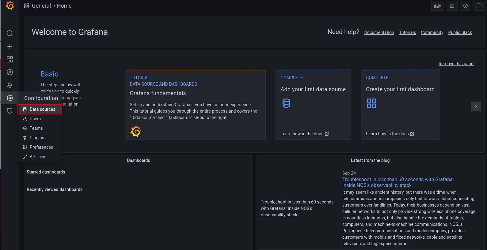
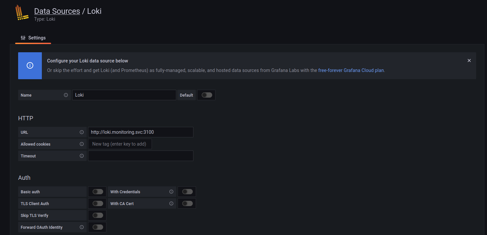
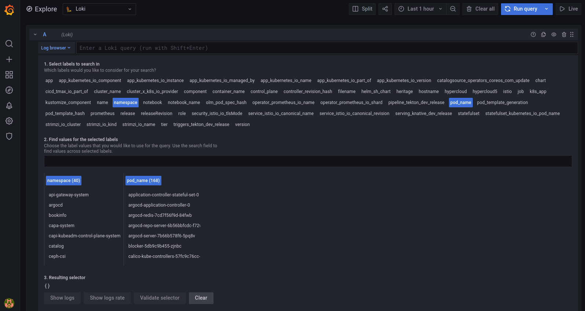

# Loki 설치 가이드

## 개요
* Loki Stack은 loki, promtail, grafana로 구성된 플랫폼 조합이다.
* K8S 클러스터로부터 promtail 수집한 로그를 loki에 적재하면, loki는 수집된 로그를 저장하고 요청에 따라 검색 기능을 제공한다. 그리고 Grafana를 통해 loki에 적재된 데이터를 시각화한다.

## 구성 요소 및 버전
* Grafana Loki ([grafana/loki:2.6.0](https://hub.docker.com/layers/loki/grafana/loki/2.6.0/images/sha256-ac642ce10cc42da2b341a918ea6711aa11a0c1852694b8350a43bcbcc2725af2?context=explore))
* Grafana Promtail ([grafana/promtail:2.6.0](https://hub.docker.com/layers/promtail/grafana/promtail/2.6.0/images/sha256-eb71a44bccea03bf5635374be3dbdd5c5ced95f3ea33aec691c0c68c39dd42fa?context=explore))

## Prerequisites
* 필수 모듈
  * [RookCeph](https://github.com/tmax-cloud/hypersds-wiki/)
  * [Grafana](https://github.com/tmax-cloud/install-grafana)

## 폐쇄망 설치 가이드
* 설치를 진행하기 전 아래의 과정을 통해 필요한 이미지 및 yaml 파일을 준비한다.
* 그 후, Install Step을 진행하면 된다.
1. 사용하는 image repository에 Loki stack 설치 시 필요한 이미지를 push한다. 

    * 작업 디렉토리 생성 및 환경 설정
    ```bash
    $ mkdir -p ~/loki-install
    $ export OS_HOME=~/loki-install
    $ cd $OS_HOME
    $ export LOKI_VERSION=2.6.0
    $ export PROMTAIL_VERSION=2.6.0
    $ export REGISTRY={ImageRegistryIP:Port}
    ```
    * 외부 네트워크 통신이 가능한 환경에서 필요한 이미지를 다운받는다.
    ```bash
    $ sudo docker pull grafana/loki:${LOKI_VERSION}
    $ sudo docker save grafana/loki:${LOKI_VERSION} > loki_${LOKI_VERSION}.tar
    $ sudo docker pull grafana/promtail:${PROMTAIL_VERSION}
    $ sudo docker save grafana/promtail:${PROMTAIL_VERSION} > promtail_${PROMTAIL_VERSION}.tar
    ```
  
2. 위의 과정에서 생성한 tar 파일들을 폐쇄망 환경으로 이동시킨 뒤 사용하려는 registry에 이미지를 push한다.
    ```bash
    $ sudo docker load < loki_${LOKI_VERSION}.tar
    $ sudo docker load < promtail_${PROMTAIL_VERSION}.tar
    
    $ sudo docker tag grafana/loki:${LOKI_VERSION} ${REGISTRY}/grafana/loki:${LOKI_VERSION}
    $ sudo docker tag grafana/promtail:${PROMTAIL_VERSION} ${REGISTRY}/grafana/promtail:${PROMTAIL_VERSION}
    
    $ sudo docker push ${REGISTRY}/grafana/loki:${LOKI_VERSION}
    $ sudo docker push ${REGISTRY}/grafana/promtail:${PROMTAIL_VERSION}
    ```

## Step 0. loki.config 설정
* 목적 : `yaml/loki.config 파일에 설치를 위한 정보 기입`
* 순서: 
	* 환경에 맞는 config 내용 작성
		* LOKI_VERSION
			* Loki 의 버전
			* ex) 2.6.0
	    * PROMTAIL_VERSION 
	        * Promtail 의 버전
			* ex) 2.6.0
		* STORAGECLASS_NAME
			* Loki가 사용할 StorageClass 의 이름
            * {STORAGECLASS_NAME} 그대로 유지시 default storageclass 사용
			* ex) csi-cephfs-sc
		* REGISTRY
			* 폐쇄망 사용시 image repository의 주소
			* 폐쇄망 아닐시 {REGISTRY} 그대로 유지
			* ex) 192.168.171:5000

## Step 1. installer 실행
* 목적 : `설치를 위한 shell script 실행`
* 순서: 
	* 권한 부여 및 실행
	``` bash
	$ sudo chmod +x yaml/install.sh
	$ sudo chmod +x yaml/uninstall.sh
	$ ./yaml/install.sh
	```

## 삭제 가이드
* 목적 : `삭제를 위한 shell script 실행`
* 순서: 
	* 실행
	``` bash
	$ ./yaml/uninstall.sh
	```

## 수동 설치 가이드
## Prerequisites
1. Namespace 생성
    * loki stack을 설치할 namespace를 생성한다.
    ```bash
    $ kubectl create ns monitoring
    ```
    
2. 변수 export
    * 다운 받을 버전을 export한다. 
    ```bash
    $ export LOKI_VERSION=2.6.0
    $ export PROMTAIL_VERSION=2.6.0
    $ export STORAGECLASS_NAME=csi-cephfs-sc
    ```

* 비고  
    * 이하 인스톨 가이드는 StorageClass 이름이 csi-cephfs-sc 라는 가정하에 진행한다.

## Install Steps
0. [Loki-stack yaml 수정](https://github.com/tmax-cloud/install-loki#step-0-loki-stack-yaml-%EC%88%98%EC%A0%95)
1. [Loki 설치](https://github.com/tmax-cloud/install-loki#step-1-loki-%EC%84%A4%EC%B9%98)
2. [Promtail 설치](https://github.com/tmax-cloud/install-loki#step-2-promtail-%EC%84%A4%EC%B9%98)

## Step 0. loki-stack yaml 수정
* 목적 : `loki-stack yaml에 이미지 registry, 버전 및 노드 정보를 수정`
* 생성 순서 : 
    * 아래의 command를 사용하여 사용하고자 하는 image 버전을 입력한다.
	```bash
	$ sed -i 's/{LOKI_VERSION}/'${LOKI_VERSION}'/g' 01_loki.yaml
	$ sed -i 's/{STORAGECLASS_NAME}/'${STORAGECLASS_NAME}'/g' 01_loki.yaml
    $ sed -i 's/{PROMTAIL_VERSION}/'${PROMTAIL_VERSION}'/g' 02_promtail.yaml
    
	```
* 비고 :
    * `폐쇄망에서 설치를 진행하여 별도의 image registry를 사용하는 경우 registry 정보를 추가로 설정해준다.`
	```bash
	$ sed -i 's/docker.io\/grafana\/loki/'${REGISTRY}'\/grafana\/loki/g' 01_loki.yaml
	$ sed -i 's/docker.io\/grafana\/promtail/'${REGISTRY}'\/grafana\/promtail/g' 02_promtail.yaml
	```    
    
## Step 1. Loki 설치
* 목적 : `Loki 설치`
* 생성 순서 : 
    * [01_loki.yaml](yaml/01_loki.yaml) 실행
	```bash
	$ kubectl apply -f 01_loki.yaml
	```     
* 비고 :
    * StorageClass 이름이 csi-cephfs-sc가 아니라면 환경에 맞게 수정해야 한다.

## Step 2. Promtail 설치
* 목적 : `loki stack의 daemon 역할을 수행하는 promtail을 설치`
* 생성 순서 : [02_promtail.yaml](yaml/02_promtail.yaml) 실행 
    ```bash
    $ kubectl apply -f 02_promtail.yaml
    ```

## Loki-Grafana 연동
* 목적: loki에 적재된 log data를 Grafana UI를 통해 조회
* 순서: 
    * Grafana UI에 접속하여 Configuration > DataSource를 클릭한다.

    
    * Datasource 화면에서 Add data source 버튼을 클릭 후, data source type 목록에서 loki를 클릭한다.

    
    * Loki 설정에서 HTTP URI에 "http://loki.monitoring.svc:3100" 을 추가한 뒤 Save & Test를 클릭한다.


* Grafana의 Explore 화면에서 Loki에 적재된 로그 내용을 확인할 수 있다.
    * ex) namespace가 kafka인 로그 조회 시, namespace label에서 kafka를 클릭 후, show logs 버튼을 클릭한다.



## 비고

### Loki와 Promtail 모듈의 log level 설정
* Loki: logger class는 DEBUG, INFO, WARN, ERROR 총 4단계로 지원, default로 설정된 log level은 INFO
* loki-config ConfigMap에서 원하는 log level로 설정한다.

ex) loki-config ConfigMap 적용 예시
    
    loki.yaml: |
      server:
        http_listen_port: 3100
        log_level: error ## 원하는 log level로 설정한다.

* Promtail: loki와 동일하게 DEBUG, INFO, WARN, ERROR 총 4단계로 지원, default로 설정된 log level은 INFO
* promtail-config ConfigMap에서 원하는 log level로 설정한다.

ex) loki-config ConfigMap 적용 예시
    
    promtail-config.yaml: |
      server:
        http_listen_port: 9080
	    grpc_listen_port: 0
        log_level: error ## 원하는 log level로 설정한다.

### Loki HA 구성 가이드
* 목적: Loki 파드에 대하여 Active-Active 방식으로 기동하기 위한 설정이다.
* Loki 구성: Loki Statefulset의 replica를 2로 수정한다.
    * ex) [01_loki.yaml](yaml/01_loki.yaml)의 statefulset 예시

    ```
    apiVersion: apps/v1
    kind: StatefulSet
    metadata:
      name: loki
      namespace: monitoring
    labels:
      app: loki
    spec:
      replicas: 2 ## 1에서 2로 수정
      selector:
        matchLabels:
          app: loki 
    ```

### Loki에서 조회할 수 있는 Label Filter 설정
* 목적: Promtail에서 로그 수집 시, 원하는 label만 볼 수 있도록 whitelist를 기반으로 필터링하기 위함.
* Promtail config에서 pipeline_stages 설정을 추가하여 조회를 원하는 label 이름을 기입한다.
    * ex) [02_promtail.yaml](yaml/02_promtail.yaml)의 configmap 예시
    
    ```
    promtail-config.yaml: |
    
    scrape_configs:
    - job_name: kubernetes-pods-name
      kubernetes_sd_configs:
      - role: pod
      pipeline_stages:
      - labelallow:            ## app, job, filename, namespace, pod_name, container_name label만 loki에서 조회할 수 있다.
          - app
          - job
          - filename
          - namespace
          - pod_name
          - container_name
      relabel_configs:
      - source_labels:
        - __meta_kubernetes_pod_label_name
      target_label: __service__
      
      ...
      
    ```
