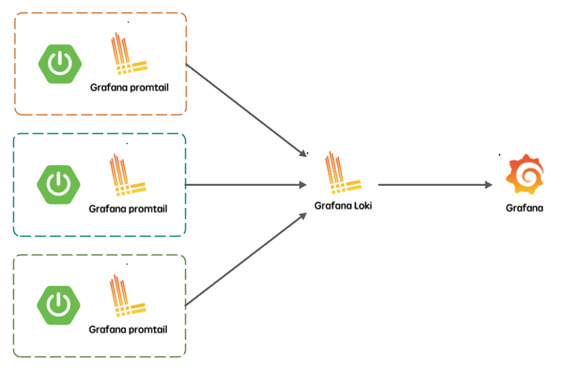
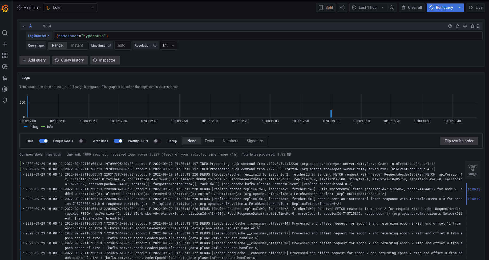

# Grafana-Loki 로그 조회 가이드

### Loki Stack 기본 구조
* Loki stack은 Promtail - Loki - Grafana로 구성되어 있다.
* Promtail을 통해 k8s cluster 로그를 수집하여 Loki에 적재하면 Grafana UI를 통해 로그를 시각화하여 볼 수 있다.
* Promtail을 통해 수집한 log data는 Loki와 연동된 pvc에 적재하여 관리하거나 별도의 저장소를 연동하여 관리할 수 있다.

## Grafana UI에서 로그 조회하기
* 목적: Promtail을 통해 로그가 Loki에 적재가 잘 되고 있는지 확인하고, explore를 통해 로그의 상세 내역을 조회할 수 있다.
* Log browser를 통해 label을 클릭하여 조회하는 방법과 LogQL을 직접 입력하여 조회하는 방법이 있다.
* Log browser로 네임스페이스 로그 조회: 
    * Explore 화면에서 Data Source로 Loki를 선택한다.
    * Log browser를 클릭 후, namespace 라벨을 클릭하여 조회하고자 하는 네임스페이스 명을 클릭한다. ex) hyperauth
    * Show logs를 클릭하여 조회한다.

* LogQL을 직접 입력하여 특정 네임스페이스에서 특정 키워드를 가진 로그를 조회:
    * Explore 화면에서 Data source로 Loki를 선택한다.
    * Log browser 버튼 옆의 빈칸에 조회하고자 하는 LogQL을 입력한 후 Run Query 버튼을 눌러 실행하거나, shift+Enter를 눌러 쿼리를 실행한다.
    * LogQL 예시
       * 특정 네임스페이스 로그를 조회할 경우: {namespace="hyperauth"}
       * 특정 네임스페이스 안의 특정 파드의 로그만 조회할 경우: {namespace="hyperauth", pod_name="kafka-kafka-0"}
           * (해당 파드를 제외한 나머지의 경우 pod_name!="kafka-kafka-0")
       * 특정 파드 안에 특정 키워드를 포함한 로그만 조회할 경우: {pod_name="kafka-kafka-0"} |= "error" 
           * (해당 키워드를 제외한 나머지의 경우 != "error")

### 비고: 
* 조회하려는 time range를 변경할 때 default로 설정되어있는 'Last 1 hour'를 클릭하면 Absolute time range를 통해 직접 설정하거나 리스트에 있는 time range를 클릭하여 변경할 수 있다.

* Explore 화면의 가장 오른쪽 위에 있는 Live 버튼을 클릭하면 실시간으로 적재되는 log를 조회하여 확인할 수 있다.

 
